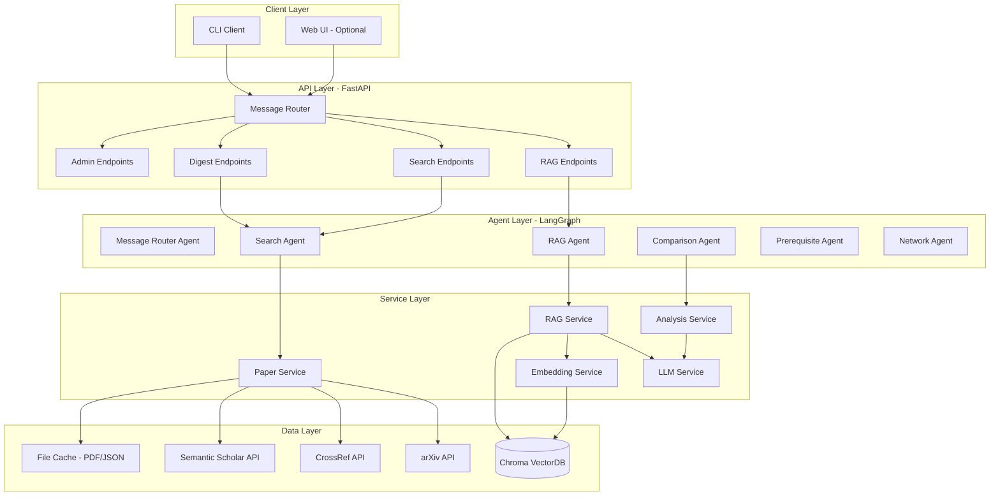
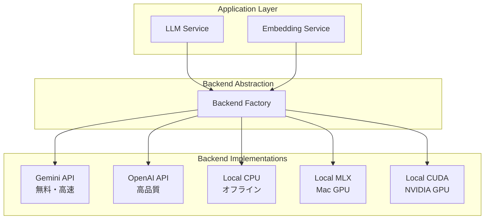

# Design Document

## Overview

Papersmith Agentは、FastAPI、Chroma、HuggingFace Transformersを使用した論文解析システムです。Phase 1では基本的な論文取得とRAG機能を実装済み。Phase 2以降で高度な機能を追加予定。

### アーキテクチャ原則

1. **ローカルファースト**: 外部API（論文取得のみ）を除き、すべての処理をローカルで実行
2. **段階的構築**: MVPから始め、機能を段階的に追加
3. **キャッシュ戦略**: メタデータ、PDF、解析結果を積極的にキャッシュ

## Architecture

### システム構成図



### Phase別実装計画

- **Phase 1（完了）**: FastAPI、arXiv API、PDF取得、Chroma、基本RAG、Docker
- **Phase 2（完了）**: Web UI（Streamlit）、マルチバックエンド対応、uv移行
- **Phase 3（次）**: Corrective Retrieval、HyDE、SSEストリーミング
- **Phase 4**: LangGraph、マルチエージェント、学習サポート

### マルチバックエンドアーキテクチャ

システムは複数のLLM/Embeddingバックエンドをサポートし、環境に応じて最適なものを選択可能：



**バックエンド選択基準:**

| バックエンド | 推奨環境 | メリット | デメリット | コスト |
|------------|---------|---------|-----------|--------|
| **gemini** | 全環境 | 無料、高速、セットアップ簡単 | インターネット必須 | 無料 |
| **openai** | 全環境 | 高品質、高速 | インターネット必須 | 有料 |
| **local-mlx** | Mac M1/M2/M3 | 高速、オフライン動作 | Macのみ、初回DL大 | 無料 |
| **local-cuda** | NVIDIA GPU | 高速、オフライン動作 | GPU必須、初回DL大 | 無料 |
| **local-cpu** | 全環境 | オフライン動作 | 非常に遅い | 無料 |

**環境変数による設定:**

```bash
# デフォルト（Gemini）
LLM_BACKEND=gemini
EMBEDDING_BACKEND=gemini
GOOGLE_API_KEY=your_api_key

# Mac開発環境
LLM_BACKEND=local-mlx
EMBEDDING_BACKEND=local-cpu

# GPU本番環境
LLM_BACKEND=local-cuda
EMBEDDING_BACKEND=local-cuda
```

## Components and Interfaces

### 1. API Layer（FastAPI）

**Phase 1 Endpoints（実装済み）:**
- `POST /papers/search` - 論文検索
- `POST /papers/download` - PDF取得とインデックス化
- `POST /rag/query` - RAG質問応答
- `POST /admin/init-index` - インデックス再構築
- `GET /health` - ヘルスチェック

**Future Phases:** Web UI、SSEストリーミング、ルーター、Digest、比較分析

### 2. Core Services（Phase 1実装済み）

- **PaperService**: 論文検索、PDF取得、テキスト抽出
- **RAGService**: IMRaD分割、チャンク化、インデックス化
- **EmbeddingService**: multilingual-e5-base使用
- **LLMService**: ELYZA-JP-8B使用（回答生成）
- **ChromaClient**: ベクター検索と保存

詳細な実装は`src/services/`を参照。


## Data Models

主要モデル: `PaperMetadata`, `SearchResult`, `RAGResponse`

詳細は`src/models/`を参照。

## Error Handling

カスタム例外: `PapersmithError`, `APIError`, `IndexNotReadyError`, `LLMError`

詳細は`src/utils/errors.py`を参照。

## Testing Strategy

テスト構成: ユニットテスト、統合テスト、E2Eテスト

詳細は`.kiro/steering/testing-guidelines.md`を参照。

## Deployment

Docker Composeで起動。GPU対応。

詳細はREADME.mdを参照。
