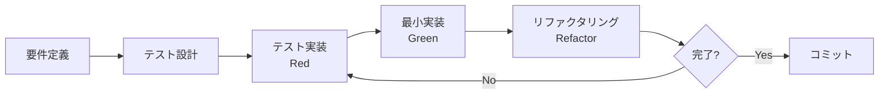

# Testing Strategy and TDD Implementation Plan

## Overview

このドキュメントは、Papersmith Agentの包括的なテスト戦略とTDD（Test-Driven Development）開発プロセスを定義します。

## Testing Goals

### Coverage Targets

| レイヤー | 目標カバレッジ | 現状 | 優先度 |
|---------|--------------|------|--------|
| **Services** | 90%+ | 未測定 | 高 |
| **API Endpoints** | 85%+ | 未測定 | 高 |
| **Models** | 95%+ | 未測定 | 中 |
| **Clients** | 80%+ | 未測定 | 中 |
| **Utils** | 90%+ | 未測定 | 中 |
| **全体** | 85%+ | 未測定 | 高 |

### Quality Metrics

- **テスト実行時間**: 全テスト < 30秒
- **統合テスト**: 実際のAPI呼び出しは最小限（モック優先）
- **E2Eテスト**: 重要なユーザーフロー3-5個
- **テスト保守性**: 各テストは独立して実行可能

## Test Structure

```
tests/
├── unit/                    # ユニットテスト（モック使用）
│   ├── services/           # サービス層
│   ├── api/                # APIエンドポイント
│   ├── models/             # データモデル
│   ├── clients/            # 外部APIクライアント
│   └── utils/              # ユーティリティ
├── integration/            # 統合テスト（実際のDB、軽量API）
│   ├── test_rag_pipeline.py
│   ├── test_chroma_integration.py
│   └── test_api_integration.py
├── e2e/                    # E2Eテスト（フルフロー）
│   ├── test_paper_workflow.py
│   └── test_rag_workflow.py
├── fixtures/               # テストフィクスチャ
│   ├── sample_papers.py
│   ├── mock_responses.py
│   └── test_data/
└── conftest.py            # pytest設定とフィクスチャ
```

## TDD Workflow

### 開発プロセス



### ステップ詳細

1. **Red（失敗するテストを書く）**
   - 新機能の期待動作をテストで定義
   - テストを実行して失敗を確認
   - テストが正しく失敗することを確認

2. **Green（テストを通す最小実装）**
   - テストを通すための最小限のコードを実装
   - 過度な最適化は避ける
   - テストが成功することを確認

3. **Refactor（リファクタリング）**
   - コードの重複を削除
   - 可読性を向上
   - テストが引き続き成功することを確認

## Test Categories

### 1. Unit Tests（ユニットテスト）

**目的**: 個別の関数・クラスの動作を検証

**特徴**:
- 外部依存をモック
- 高速実行（< 0.1秒/テスト）
- 高いカバレッジ

**例**:
```python
# tests/unit/services/test_llm_service.py
def test_build_prompt():
    """プロンプト構築のテスト"""
    service = LLMService()
    prompt = service._build_prompt("質問", "コンテキスト")
    assert "質問" in prompt
    assert "コンテキスト" in prompt
```

### 2. Integration Tests（統合テスト）

**目的**: 複数コンポーネントの連携を検証

**特徴**:
- 実際のChromaDB使用
- 外部APIはモック
- 中速実行（< 1秒/テスト）

**例**:
```python
# tests/integration/test_rag_pipeline.py
def test_rag_pipeline_with_real_chroma():
    """RAGパイプライン全体のテスト"""
    # 実際のChromaDBを使用
    # LLMはモック
```

### 3. E2E Tests（E2Eテスト）

**目的**: ユーザーフロー全体を検証

**特徴**:
- 実際のAPIエンドポイント使用
- 重要なフローのみ
- 低速実行（< 5秒/テスト）

**例**:
```python
# tests/e2e/test_paper_workflow.py
def test_search_download_index_query():
    """論文検索→ダウンロード→インデックス→質問のフルフロー"""
```

## Coverage Configuration

### pytest.ini

```ini
[tool:pytest]
testpaths = tests
python_files = test_*.py
python_classes = Test*
python_functions = test_*
addopts = 
    --verbose
    --cov=src
    --cov-report=html
    --cov-report=term-missing
    --cov-fail-under=85
    --asyncio-mode=auto
markers =
    unit: Unit tests (fast, mocked)
    integration: Integration tests (medium speed, real DB)
    e2e: End-to-end tests (slow, full flow)
    slow: Slow tests (skip in CI)
```

### Coverage Exclusions

```ini
[coverage:run]
omit =
    tests/*
    */__pycache__/*
    */site-packages/*
    */venv/*
    */.venv/*

[coverage:report]
exclude_lines =
    pragma: no cover
    def __repr__
    raise AssertionError
    raise NotImplementedError
    if __name__ == .__main__.:
    if TYPE_CHECKING:
    @abstractmethod
```

## Test Fixtures

### Common Fixtures

```python
# tests/conftest.py

import pytest
from src.clients.chroma_client import ChromaClient
from src.services.llm_service import LLMService
from src.services.embedding_service import EmbeddingService

@pytest.fixture
def chroma_client():
    """テスト用Chromaクライアント"""
    client = ChromaClient(persist_directory=":memory:")
    client.initialize()
    yield client
    # クリーンアップ

@pytest.fixture
def mock_llm_service(mocker):
    """モックLLMサービス"""
    service = mocker.Mock(spec=LLMService)
    service.generate.return_value = "テスト回答"
    return service

@pytest.fixture
def sample_paper_metadata():
    """サンプル論文メタデータ"""
    return {
        "arxiv_id": "2301.00001",
        "title": "Test Paper",
        "authors": ["Author 1", "Author 2"],
        "year": 2023
    }
```

## CI/CD Integration

### GitHub Actions Workflow

```yaml
name: Tests

on: [push, pull_request]

jobs:
  test:
    runs-on: ubuntu-latest
    
    steps:
      - uses: actions/checkout@v4
      
      - name: Install uv
        uses: astral-sh/setup-uv@v1
        
      - name: Set up Python
        run: uv python install 3.12
        
      - name: Install dependencies
        run: uv sync --frozen --extra dev
        
      - name: Run unit tests
        run: uv run pytest tests/unit -m unit --cov=src --cov-report=xml
        
      - name: Run integration tests
        run: uv run pytest tests/integration -m integration
        
      - name: Upload coverage
        uses: codecov/codecov-action@v3
        with:
          file: ./coverage.xml
```

## Test Implementation Priority

### Phase 1: Critical Path Coverage（優先度：高）

1. **LLMService & EmbeddingService**
   - バックエンド切り替えロジック
   - 各バックエンドの基本動作
   - エラーハンドリング

2. **RAGService**
   - インデックス化フロー
   - 検索フロー
   - コンテキスト構築

3. **API Endpoints**
   - /papers/search
   - /papers/download
   - /rag/query
   - /health

### Phase 2: Service Layer Coverage（優先度：中）

4. **PaperService**
   - 論文検索
   - PDFダウンロード
   - メタデータ管理

5. **ChromaClient**
   - インデックス作成
   - ベクター検索
   - メタデータフィルタ

### Phase 3: Edge Cases & E2E（優先度：中）

6. **エラーケース**
   - API障害時の動作
   - 不正な入力
   - リソース不足

7. **E2Eフロー**
   - 論文検索→ダウンロード→質問
   - マルチバックエンド切り替え

## Mocking Strategy

### External APIs

```python
# tests/fixtures/mock_responses.py

MOCK_ARXIV_RESPONSE = {
    "entries": [
        {
            "id": "http://arxiv.org/abs/2301.00001",
            "title": "Test Paper",
            "authors": [{"name": "Author 1"}],
            "published": "2023-01-01"
        }
    ]
}

MOCK_GEMINI_RESPONSE = {
    "text": "これはテスト回答です。"
}
```

### Database

```python
# In-memory Chromaを使用
@pytest.fixture
def in_memory_chroma():
    client = ChromaClient(persist_directory=":memory:")
    client.initialize()
    return client
```

## Performance Testing

### Load Testing

```python
# tests/performance/test_load.py

def test_concurrent_rag_queries():
    """同時RAGクエリのパフォーマンステスト"""
    import concurrent.futures
    
    with concurrent.futures.ThreadPoolExecutor(max_workers=10) as executor:
        futures = [
            executor.submit(rag_service.query, f"質問{i}")
            for i in range(100)
        ]
        results = [f.result() for f in futures]
    
    assert len(results) == 100
    # 平均応答時間 < 2秒
```

## Documentation

### Test Documentation

各テストファイルに以下を含める：

```python
"""
Module: test_llm_service.py
Purpose: LLMServiceのユニットテスト

Test Coverage:
- バックエンド初期化
- プロンプト構築
- 回答生成
- エラーハンドリング

Requirements: 12.2, 12.3, 2.5
"""
```

## Maintenance

### Test Review Checklist

- [ ] テストは独立して実行可能か
- [ ] テスト名は明確か（何をテストしているか）
- [ ] アサーションは具体的か
- [ ] モックは適切に使用されているか
- [ ] テストデータは再利用可能か
- [ ] エラーケースもカバーしているか

### Refactoring Tests

- 重複するセットアップコードをフィクスチャに抽出
- 共通のアサーションをヘルパー関数に
- テストデータをfixtures/に集約

## Tools

### Required Packages

```toml
[project.optional-dependencies]
dev = [
    "pytest==7.4.3",
    "pytest-asyncio==0.21.1",
    "pytest-mock==3.12.0",
    "pytest-cov>=4.1.0",      # カバレッジ測定
    "pytest-xdist>=3.3.0",    # 並列実行
    "pytest-timeout>=2.1.0",  # タイムアウト
    "coverage[toml]>=7.3.0",  # カバレッジレポート
]
```

### Commands

```bash
# 全テスト実行
uv run pytest

# ユニットテストのみ
uv run pytest tests/unit -m unit

# カバレッジ付き
uv run pytest --cov=src --cov-report=html

# 並列実行
uv run pytest -n auto

# 特定のテスト
uv run pytest tests/unit/services/test_llm_service.py::test_build_prompt

# 失敗したテストのみ再実行
uv run pytest --lf

# 詳細出力
uv run pytest -vv
```

## Success Criteria

テスト戦略が成功したと言える基準：

1. ✅ 全体カバレッジ85%以上
2. ✅ 全テスト実行時間 < 30秒
3. ✅ CI/CDで自動実行
4. ✅ 新機能は必ずテストファースト
5. ✅ バグ修正時は再現テストを追加
6. ✅ テストドキュメントが最新
7. ✅ チーム全員がTDDを実践
